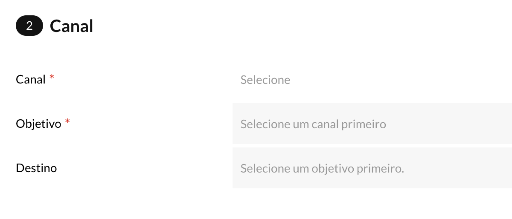
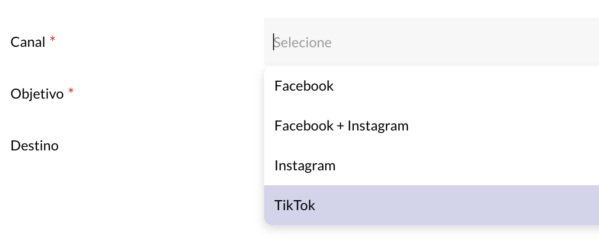
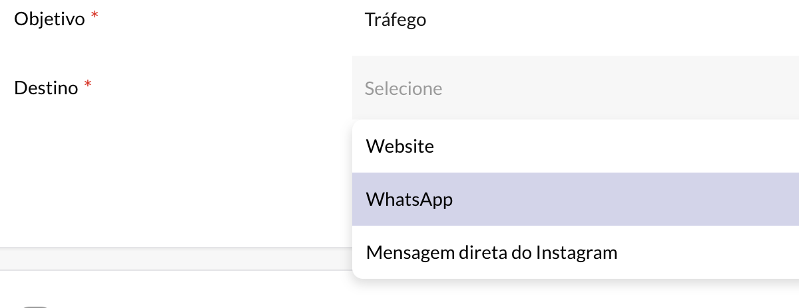

import Image from 'next/image'
import ReactPlayer from 'react-player'

# 🔥 04/06/2024

A última atualização do Publicitário está cheia de recursos novos que vão levar as campanhas para o próximo nível. Confira todas as novidades abaixo!

## 🚀 Release Notes

### ✨ Canais na criação de campanhas

- Adicionamos um novo passo na criação de campanhas para isolar as opções relacionadas a canais. Isso nos permite incluir várias novidades descritas a seguir:

#### 🎉 TikTok 

- Sim, o TikTok agora está disponível no Publicitário!

#### 🎉 Seleção de destino

- Agora você pode selecionar um destino específico para o cliente ser direcionado imediatamente após clicar no call to action do anúncio. Os destinos podem incluir um site, WhatsApp, entre outros, dependendo do canal e objetivo selecionados previamente.

#### 🎉 Seleção de conta e página

- Adicionamos a opção de selecionar conta e página, disponível apenas para clientes que tiverem essas opções liberadas na Central de Negócios.

### ✨ Sugestão de descrição com IA

- Ao criar um anúncio, agora você conta com um assistente inteligente que ajuda a gerar sugestões de descrição! Confira o vídeo abaixo para ver como funciona:

 
<ReactPlayer controls url='/video1.mp4' />

## 🤔 Saiba Mais

##### Benefícios do Uso de IA em suas Campanhas
A integração da Inteligência Artificial no Publicitário traz uma série de benefícios. Com o novo assistente de descrição, você pode:

- Economizar Tempo: A IA gera sugestões de descrições rapidamente, reduzindo o tempo que você gastaria criando conteúdo do zero.
- Melhorar a Qualidade: As sugestões de descrições são baseadas nas melhores práticas e dados de desempenho, ajudando a aumentar a eficácia de seus anúncios.
- Aprimorar a Criatividade: Se você está com bloqueio criativo, o assistente de descrição pode fornecer ideias e inspirações para melhorar seus textos.
- Aumento da Conversão: Descrições bem elaboradas e alinhadas com o público tendem a gerar mais engajamento e conversões.

Experimente essa novidade e veja como a IA pode transformar a maneira como você cria suas campanhas!