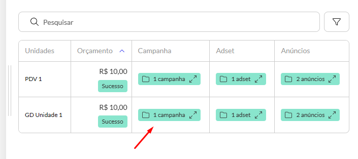
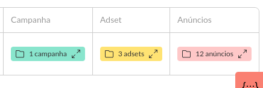
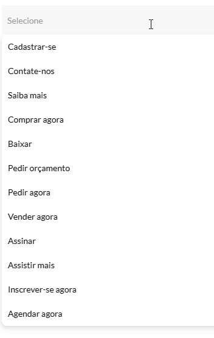
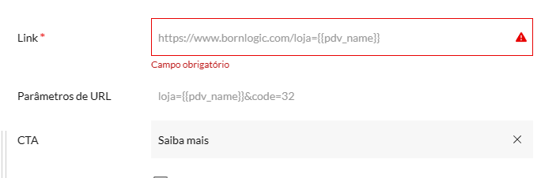
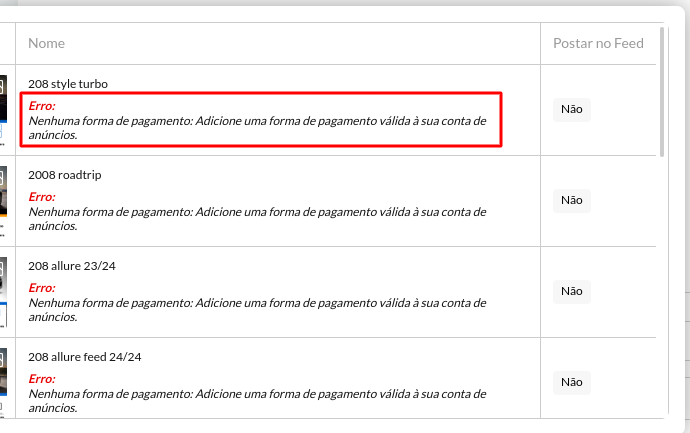

import Image from 'next/image'

# 🔥 11/04/2024

Esperamos que essas atualizações tornem sua experiência com o nosso aplicativo ainda mais produtiva e agradável. Continuamos comprometidos em fornecer melhorias contínuas e valor para nossos usuários. Se você tiver algum feedback ou sugestão, não hesite em nos contatar. Agradecemos pelo seu apoio contínuo!

Confira abaixo as principais mudanças implementadas nesta versão:

## 🚀 Release Notes

### ✨ Aperfeiçoamento do Detalhamento de Tarefas no Histórico

- Agora, ao visualizar o detalhamento de uma tarefa de criação de anúncios, você encontrará tags nas colunas de campanha, adsets e ads. Ao clicar nas tags, você encontrará mais informacões sobre o item, proporcionando uma experiência mais intuitiva e informativa.

*visualizando tags no detalhamento*

- Introduzimos uma escala de cores nas tags para informar o status das ações realizadas:

  * Verde: Todas as ações foram executadas com sucesso.
  * Amarelo: Algumas ações tiveram falhas.
  * Vermelho: Todas as ações tiveram falhas.
  * Cinza: Nenhuma ação possui informação de sucesso ou falha.

*tags com legenda de cores*

### ✨ Adição de Novos CTAs Personalizados

- Incluímos novos Call-to-Actions (CTAs) de acordo com os objetivos definidos. Por exemplo, para vendas, você encontrará mais opções relevantes para impulsionar suas campanhas.

*novos CTAs*

### ✨ Aprimoramento na Validação de CTA e Link

- Implementamos validação cruzada nos campos de CTA e Link, isso é especialmente útil quando são opcionais (ex:campanhas de interação). Agora, se você preencher um dos campos, o outro se tornará obrigatório, garantindo consistência nos seus anúncios.

*validação cruzada: link se torna obrigatório se existe um CTA e vice-versa*

### ✨ Melhoria na Exibição de Mensagens de Erro

- Ajustamos a forma como as informações de erro são apresentadas, tornando-as mais explícitas e detalhadas. Agora, você terá uma compreensão clara do motivo da falha, facilitando a correção de problemas e a otimização do seu fluxo de trabalho.

*mensagem de erro mais explícita*

## 🤔 Saiba Mais
### ✨ A Importância de um Bom CTA em seus Anúncios

Você já parou para pensar no poder de persuasão que um Call-to-Action (CTA) bem elaborado possui? Em um mundo digital inundado por informações, é crucial destacar-se e direcionar seu público-alvo para a ação desejada. Um CTA eficaz não apenas aumenta as chances de conversão, mas também guia os usuários pelo caminho desejado, seja para fazer uma compra, assinar uma newsletter ou interagir com seu conteúdo.

Portanto, ao criar seus anúncios, não subestime o poder do CTA. Ele pode ser o diferencial entre um simples espectador e um cliente engajado.

Lembre-se: o CTA é mais do que uma simples frase; é o convite para uma ação que pode impulsionar o sucesso do seu negócio!