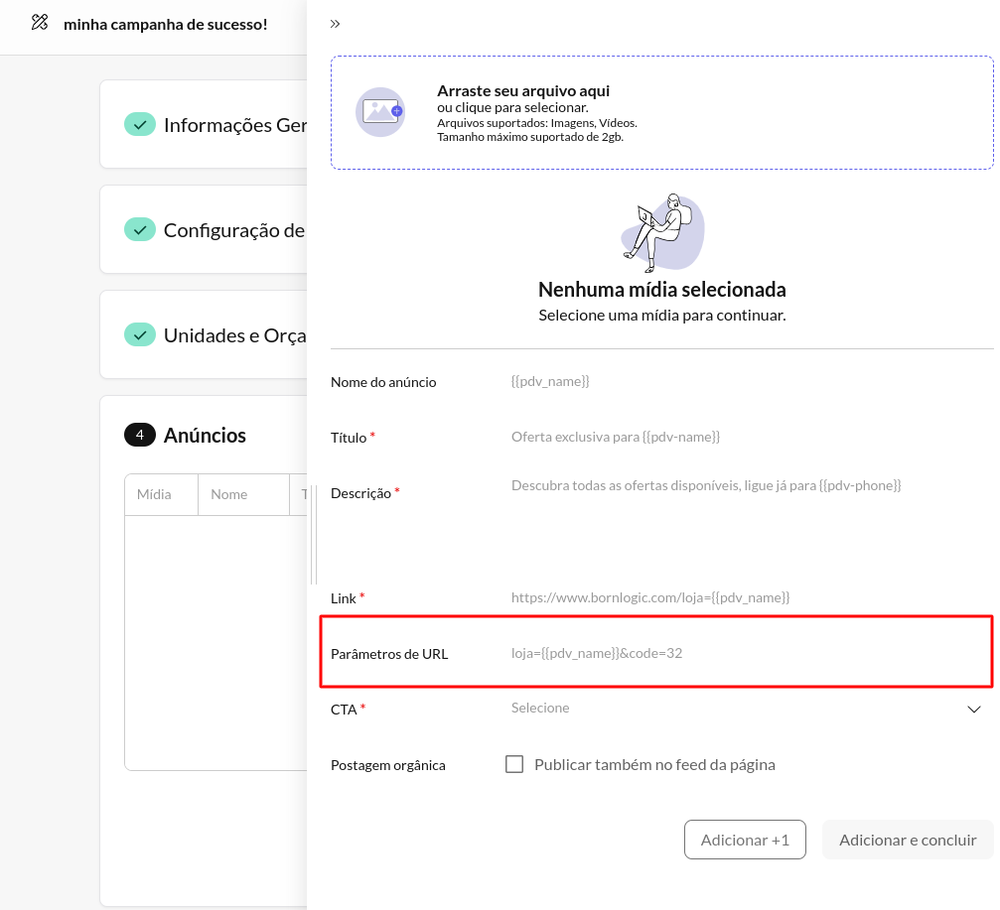
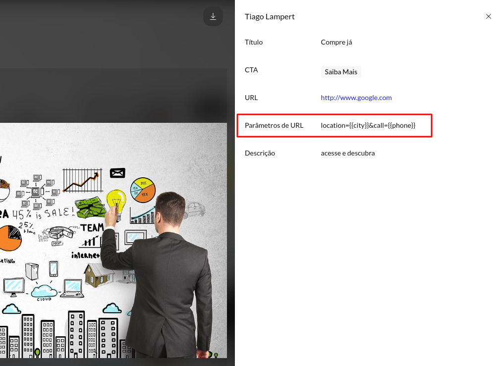

import Image from 'next/image'

# 🔥 22/03/2024

Esta versão traz melhorias na personalização dos seus anúncios, proporcionando uma experiência ainda mais flexível e detalhada. Estamos comprometidos em fornecer ferramentas que ajudem você a alcançar seus objetivos de forma eficaz e eficiente. Esta atualização representa mais um passo em direção a esse objetivo.

## 🚀 Release Notes

### ✨ Parâmetros de URL

- Agora, durante a criação de um anúncio, no passo 4 do processo de criação de uma campanha, você pode incluir os **Parâmetros de URL**. Isso amplia suas opções para personalizar e otimizar seus links de referência, utilizando as tags disponíveis para o seu negócio. Mais controle significa mais oportunidades de maximizar o desempenho dos seus anúncios.

*configurando parâmetros da URL*

*utilizando tags do Business*

- Analogamente, ao visualizar os detalhes de um anúncio, o campo Parâmetros de URL será exibido caso tenha sido preenchido durante a sua criação. Permitindo uma prévia mais completa e precisa do seu anúncio.

*visualizando parâmetros criados*

## 🤔 Saiba Mais
### ✨ Desvendando os Parâmetros de URL
Os Parâmetros de URL são como marcadores *mágicos*  que revelam de onde vem o tráfego do seu site. Ao adicioná-los aos seus links, você desbloqueia uma janela para entender exatamente quais campanhas estão funcionando e de onde vêm seus visitantes. É como ter um GPS para o sucesso do seu marketing online.